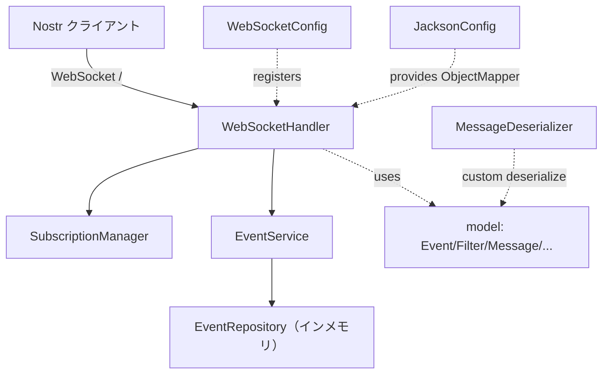
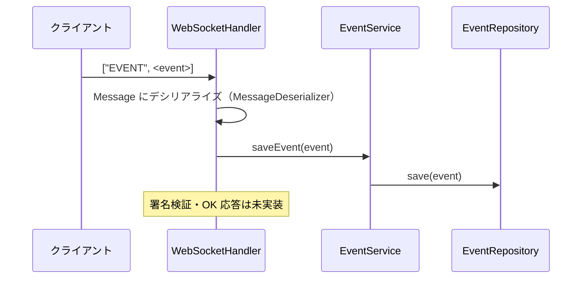
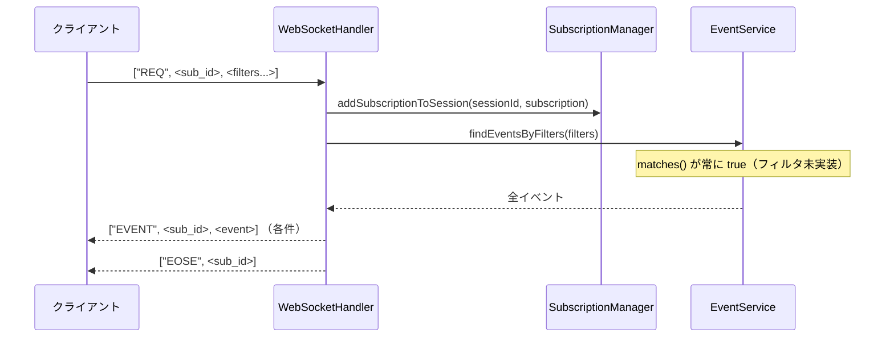
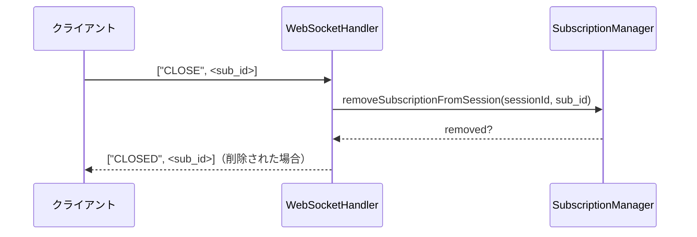

# Architecture — Jostrel

## System Overview

Jostrel は単一の Spring Boot アプリケーションとして動作する Nostr リレー。WebSocket ハンドラを入口に、購読管理サービスとイベントサービス、インメモリのイベントリポジトリで構成される、レイヤ分割されたモノリスである。

## Architectural Style

**モジュラモノリス / レイヤードアーキテクチャ**。根拠:
- 単一 Maven モジュール、単一デプロイ単位。
- config / handler / service / repository / model のレイヤでパッケージが分離。
- コンポーネント間はメソッド呼び出しで結合（分散境界なし）。

## Component Relationships

## Data Flow

### EVENT（イベント保存）

### REQ（購読 + 一致イベント返却）

### CLOSE（購読解除）

## Key Design Decisions

- **カスタムデシリアライザ**（`MessageDeserializer`）で Nostr の配列形式メッセージ（`[<type>, <payload>...]`）を `Message` にマッピング。NIP-01 のワイヤフォーマットに合わせた設計。
- **セッション×購読の二層マップ**（`SubscriptionManager` の `ConcurrentHashMap<sessionId, Map<subId, Subscription>>`）でスレッドセーフに購読を管理。
- **リポジトリパターン**でイベント保管を抽象化（現状の実体は `CopyOnWriteArrayList`）。永続化技術の差し替え余地を残す設計。

## Interaction Diagrams

上記 Data Flow の3シーケンス図（EVENT / REQ / CLOSE）が主要な業務トランザクションの実装を表す。

## Improvement Opportunities

- フィルタマッチングの実装（`EventService.matches` の TODO 解消）。
- 永続化層の実体化（リポジトリ抽象は既にあるため差し替えやすい）。
- 署名検証の追加（`EVENT` 受信時、`OK` 応答とあわせて）。
- CI/カバレッジ整備による回帰検知。
