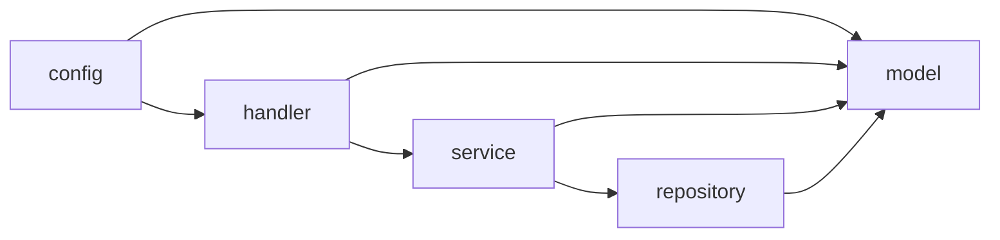

# Dependencies — Jostrel

## External Dependencies（`pom.xml`）

| 依存 | バージョン | スコープ | 用途 |
|---|---|---|---|
| `spring-boot-starter-parent` | 3.5.0 | parent | 依存バージョン管理・プラグイン管理 |
| `spring-boot-starter-websocket` | （親管理） | compile | WebSocket サーバー機能 |
| `org.projectlombok:lombok` | 1.18.38 | provided | コンパイル時ボイラープレート生成 |
| `spring-boot-starter-test` | （親管理） | test | テスト（JUnit 5, Spring Test） |

推移的依存として Jackson（`spring-boot-starter-json` 経由）を JSON 処理に使用。

## Internal Cross-Package Dependencies

- `config` → `handler`（`WebSocketConfig` がハンドラを登録）, `model`（`JacksonConfig` が `Message`/`MessageDeserializer` を参照）
- `handler` → `service`（`SubscriptionManager`, `EventService`）, `model`
- `service` → `repository`（`EventService` → `EventRepository`）, `model`
- `repository` → `model`（`Event`）

循環依存は検出されず。レイヤは上位（config/handler）→ 下位（service/repository/model）へ一方向。

## Dependency Management

- **Dependabot**（`.github/dependabot.yml`）で依存更新を自動提案。
